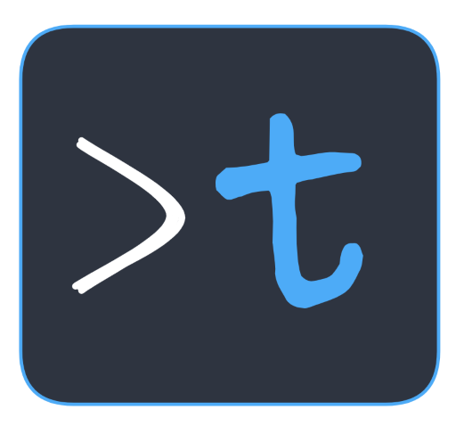

# Termoki  

A terminal emulator built with web tech (Electronjs and TypeScript)  

 

## Installation

  ### 1. Through Installers
  - Go to [releases](https://github.com/jjeem/termoki/releases)
  - Choose the version (latest version is recommended)
  - Click on `Assets`
  - Pick the installer that suits your operating system

  ### 2. Build manually
  Follow the steps for preparing local setup and packaging in the contribute [guide](./docs/CONTRIBUTE.md)

 

## Contribute

see [CONTRIBUTE.md](./docs/CONTRIBUTE.md)

